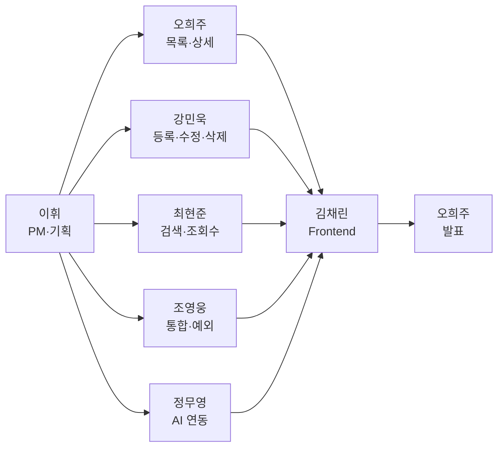
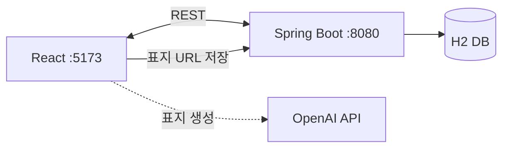
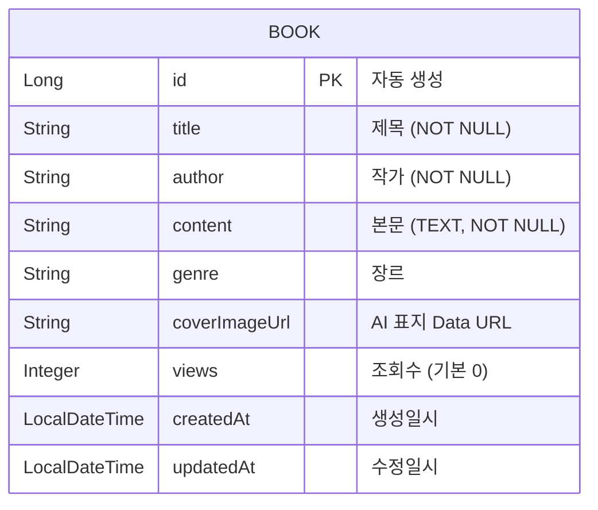
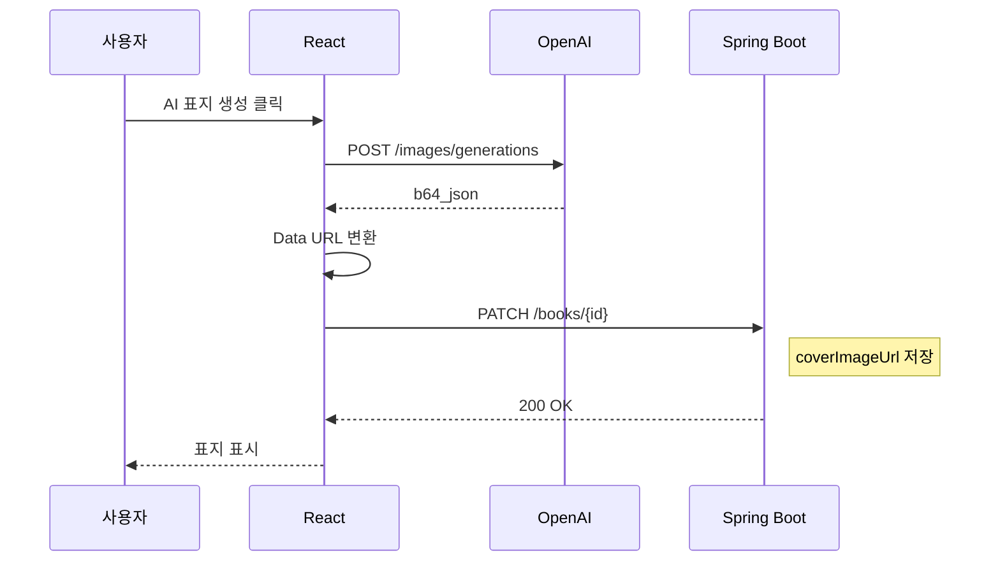

# 도서관리시스템 서버 개발 (Backend)

> AI를 활용한 도서표지 이미지 생성  
> **KT AIVLE School · AI 트랙 미니프로젝트 5차 · 5반 13조 · ✅ 개발 완료**

---

## 팀 정보

| 항목 | 내용 |
|------|------|
| **조** | 5반 13조 |
| **GitHub** | https://github.com/KT-MINI-Book/book-spring |

---

## R&R

| 역할 | 담당자 | 주요 업무 |
|------|--------|-----------|
| 조장 / PM · 기획 | **이휘** | ERD · API 정의서 · README · 일정 관리 |
| 발표자 / 백엔드 | **오희주** | 도서 목록·상세 조회 API |
| 백엔드 | **강민욱** | 도서 등록·수정·삭제 API |
| 서기 / 백엔드 | **최현준** | 도서 검색·조회수 API |
| 통합 / 예외 처리 | **조영웅** | API 통합 · 오류 응답 관리 |
| AI 연동 | **정무영** | OpenAI 표지 생성 흐름 |
| Front-end 연동 | **김채린** | React 연동 · fetch · E2E 시연 |



---

## 프로젝트 개요

4차 Frontend의 `json-server`를 **Spring Boot + JPA + H2**로 교체하고, React와 연동되는 REST API 및 AI 표지 저장 기능을 구현했습니다.



| 구분 | 기술 |
|------|------|
| Backend | Spring Boot 3 · Spring MVC · JPA · Lombok · Validation |
| DB | H2 (In-Memory) |
| Frontend | React 19 · Vite (4차 프로젝트) |
| AI | OpenAI GPT Image 2 |

### 구현 완료 기능

| 기능 | 설명 |
|------|------|
| 도서 CRUD | 등록 · 목록 · 상세 · 수정 · 삭제 |
| 도서 검색 | 제목 · 작가 · 본문 키워드 검색 |
| 조회수 | 상세 진입 시 조회수 증가 |
| AI 표지 | Frontend 생성 → Backend `coverImageUrl` 저장 |
| 예외 처리 | 도서 없음(404) · 입력값 검증(400) 통합 응답 |
| Frontend 연동 | CORS 설정 · React 풀스택 E2E 동작 확인 |

---

## ERD



---

## API 정의서

**Base URL:** `http://localhost:8080`

| Method | Endpoint | 설명 | Request Body | Response |
|--------|----------|------|--------------|----------|
| `GET` | `/books` | 도서 목록 조회 | — | `Book[]` |
| `GET` | `/books/{id}` | 도서 상세 조회 | — | `Book` |
| `GET` | `/books/search?q={keyword}` | 키워드 검색 (미입력 시 전체) | — | `Book[]` |
| `POST` | `/books` | 도서 등록 | `{ title, author, content, genre? }` | `Book` (201) |
| `PATCH` | `/books/{id}` | 도서 부분 수정 (표지 URL 포함) | `{ title?, author?, content?, genre?, coverImageUrl? }` | `Book` |
| `DELETE` | `/books/{id}` | 도서 삭제 | — | 204 |
| `PATCH` | `/books/{id}/views` | 조회수 +1 | — | `Book` |

**Book 응답 예시**

```json
{
  "id": 1,
  "title": "봄날의 산책",
  "author": "홍길동",
  "content": "따뜻한 봄바람 속 이야기...",
  "genre": "에세이",
  "coverImageUrl": "data:image/png;base64,...",
  "views": 3,
  "createdAt": "2026-06-09T10:00:00",
  "updatedAt": "2026-06-09T10:00:00"
}
```

**에러 응답**

| Status | 상황 | Code |
|--------|------|------|
| 400 | 입력값 검증 실패 | `CMN002` |
| 404 | 도서 없음 | `BOOK001` |
| 500 | 서버 오류 | `CMN001` |

---

## AI 표지 생성 흐름

> API Key는 **Frontend에서만** 사용 · Backend는 `coverImageUrl`만 저장



---

## 실행 방법

```bash
# Backend
gradlew.bat bootRun          # Windows
./gradlew bootRun            # macOS / Linux

# Frontend (4차 프로젝트)
npm install && npm run dev
```

| 항목 | 값 |
|------|-----|
| Backend | http://localhost:8080 |
| Frontend | http://localhost:5173 |
| H2 Console | http://localhost:8080/h2-console |
| JDBC URL | `jdbc:h2:mem:bookdb` |
| Username / Password | `mini5` / `1234` |

---

## 패키지 구조

```
com.aivle.bookapp
├── config/            WebConfig (CORS)
├── controller/        BookController
├── domain/            Book
├── repository/        BookRepository
├── services/          BookService
└── global/exception/    GlobalExceptionHandler, BookNotFoundException
```
