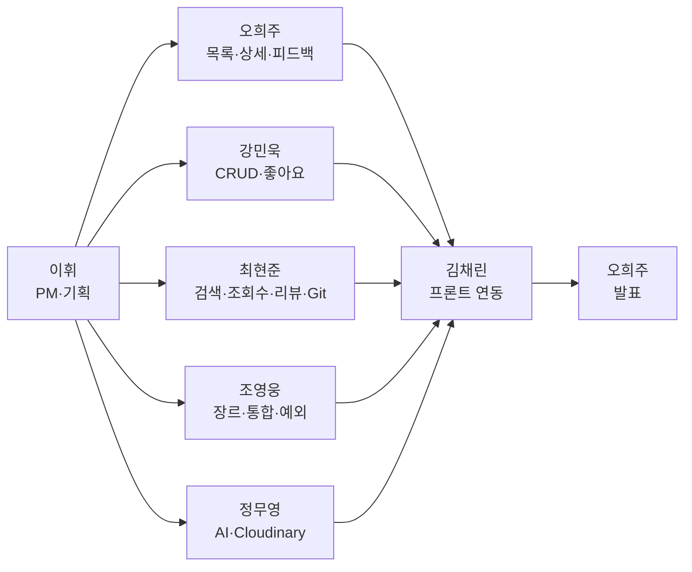
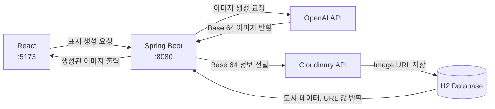
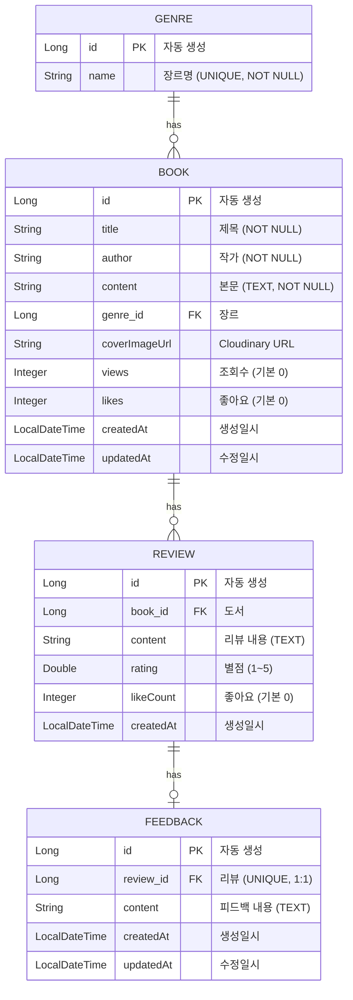
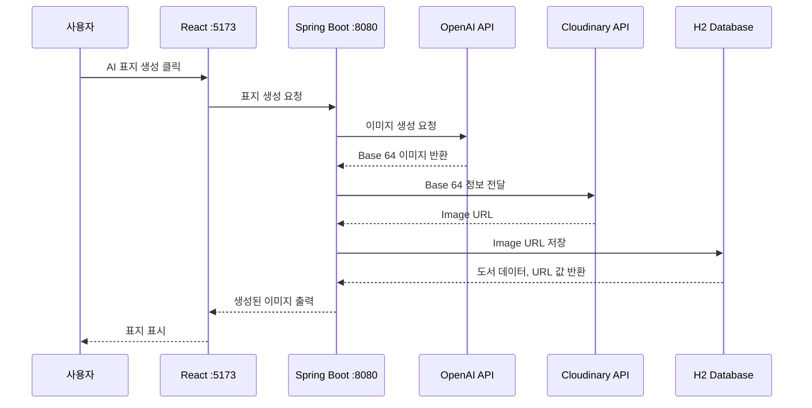

# 도서관리시스템 서버 개발 (Backend)

> AI를 활용한 도서표지 이미지 생성  
> **KT AIVLE School · AI 트랙 미니프로젝트 5차 · 5반 13조**

---

## 팀 정보

| 항목 | 내용 |
|------|------|
| **조** | 5반 13조 |
| **GitHub** | https://github.com/KT-MINI-Book/book-spring |

---

## R&R

| 역할 | 담당자 | 주요 업무 |
|------|--------|-----------|
| 조장 / PM · 기획 | **이휘** | ERD · API 정의서 · README · 일정 관리 |
| 발표자 / 백엔드 | **오희주** | 도서 목록·상세 조회 · 피드백 CRUD |
| 백엔드 | **강민욱** | 등록·수정·삭제 · 좋아요 |
| 서기 / 백엔드 · Git | **최현준** | 도서 검색·조회수 · 리뷰 CRUD·좋아요·별점 · Git 관리 |
| 통합 / 예외 처리 | **조영웅** | 장르 추가·조회 · API 통합 · 전역 예외 처리 |
| AI 연동 | **정무영** | OpenAI 표지 생성 · Cloudinary 업로드 |
| 프론트엔드 연동 | **김채린** | 프론트엔드 연동 · API 연결 |



---

## 프로젝트 개요

- 4차 Frontend `json-server` → **Spring Boot + JPA + H2** Backend 전환
- React 연동 REST API 구현
- 도서 · 장르 · 리뷰 · 피드백 CRUD · 검색 · 조회수 · 좋아요 · 평균 별점
- Backend AI 표지 생성(OpenAI + Cloudinary) · `coverImageUrl` 저장
- 전역 예외 처리 · CORS 설정 · Mock 데이터 적재



---

## 기술 스택

| 구분 | 기술 |
|------|------|
| Language | Java 17 |
| Backend | Spring Boot 4 · Spring MVC · Spring Data JPA · Validation · RestClient |
| DB | H2 (File-based, `./data/bookdb`) |
| Frontend | React 19 · Vite (4차 프로젝트) |
| AI | OpenAI GPT Image 2 |
| Storage | Cloudinary (표지 이미지 CDN) |
| Build | Gradle 9 |

---

## 주요 구현 결과

| 기능 | 설명 |
|------|------|
| 도서 CRUD | 등록 · 목록 · 상세 · 수정 · 삭제 |
| 장르 관리 | 장르 등록 · 목록 · 장르별 도서 조회 · Genre FK 연동 |
| 도서 검색 | 제목 · 작가 · 본문 키워드 검색 |
| 조회수 / 좋아요 | 조회수 증가 · 도서 좋아요 |
| 리뷰 | 도서별 리뷰 CRUD · 평균 별점 · 리뷰 좋아요 |
| 피드백 | 리뷰 1:1 피드백 CRUD |
| AI 표지 | OpenAI 호출 → Cloudinary 업로드 → URL 반환 |
| 예외 처리 | `GlobalExceptionHandler` + `ErrorCode` 통합 JSON 응답 |
| Frontend 연동 | CORS 설정 · React E2E 연동 |
| Mock 데이터 | `data.sql` — 도서 30권 · 장르 21개 · 리뷰 77건 · 피드백 34건 |

---

## ERD



---

## API 명세

**Base URL:** `http://localhost:8080`

### 도서 (`/books`)

| Method | Endpoint | 설명 | Request Body | Response |
|--------|----------|------|--------------|----------|
| `GET` | `/books` | 도서 목록 조회 | — | `BookResponse[]` |
| `GET` | `/books/{id}` | 도서 상세 조회 | — | `BookDetailResponse` |
| `GET` | `/books/search?q={keyword}` | 키워드 검색 (미입력 시 전체) | — | `BookResponse[]` |
| `POST` | `/books` | 도서 등록 | `{ title, author, content, genreId, coverImageUrl? }` | `BookDetailResponse` (201) |
| `PATCH` | `/books/{id}` | 도서 부분 수정 | `{ title?, author?, content?, genreId?, coverImageUrl? }` | `BookDetailResponse` |
| `DELETE` | `/books/{id}` | 도서 삭제 | — | 204 |
| `PATCH` | `/books/{id}/views` | 조회수 +1 | — | `BookDetailResponse` |
| `PATCH` | `/books/{id}/likes` | 좋아요 +1 | — | `BookDetailResponse` |

### 장르 (`/genres`)

| Method | Endpoint | 설명 | Request Body | Response |
|--------|----------|------|--------------|----------|
| `GET` | `/genres` | 장르 목록 조회 | — | `Genre[]` |
| `POST` | `/genres` | 장르 등록 | `{ name }` | `Genre` (201) |
| `GET` | `/genres/{genreId}/books` | 장르별 도서 조회 | — | `BookResponse[]` |

### 리뷰

| Method | Endpoint | 설명 | Request Body | Response |
|--------|----------|------|--------------|----------|
| `GET` | `/books/{bookId}/reviews` | 도서별 리뷰 목록 | — | `ReviewResponse[]` |
| `GET` | `/books/{bookId}/reviews/rating` | 평균 별점 | — | `Double` |
| `POST` | `/books/{bookId}/reviews` | 리뷰 등록 | `{ content, rating }` | `ReviewResponse` |
| `PATCH` | `/reviews/{reviewId}` | 리뷰 수정 | `{ content?, rating? }` | `ReviewResponse` |
| `DELETE` | `/reviews/{reviewId}` | 리뷰 삭제 | — | 200 |
| `PATCH` | `/reviews/{reviewId}/like` | 리뷰 좋아요 +1 | — | `ReviewResponse` |

### 피드백

| Method | Endpoint | 설명 | Request Body | Response |
|--------|----------|------|--------------|----------|
| `GET` | `/reviews/{reviewId}/feedback` | 피드백 조회 | — | `FeedbackResponse` / 204 |
| `POST` | `/reviews/{reviewId}/feedback` | 피드백 등록 | `{ content }` | `FeedbackResponse` |
| `PATCH` | `/feedbacks/{feedbackId}` | 피드백 수정 | `{ content }` | `FeedbackResponse` |
| `DELETE` | `/feedbacks/{feedbackId}` | 피드백 삭제 | — | 204 |

### AI 표지 (`/api/ai`)

| Method | Endpoint | 설명 | Request Body | Response |
|--------|----------|------|--------------|----------|
| `GET` | `/api/ai/test` | API 동작 확인 | — | `String` |
| `POST` | `/api/ai/cover` | AI 표지 생성 | `{ apiKey, title, author, content, quality? }` | `{ coverImageUrl }` |

### 응답 예시

**BookDetailResponse**

```json
{
  "id": 1,
  "title": "자바의 정석",
  "author": "남궁성",
  "content": "자바의 기본 문법, 객체지향 프로그래밍...",
  "genreId": 1,
  "genre": "프로그래밍",
  "coverImageUrl": "https://res.cloudinary.com/...",
  "views": 152,
  "likes": 0,
  "createdAt": "2026-02-22T23:27:20",
  "updatedAt": "2026-02-22T23:27:20"
}
```

**ReviewResponse**

```json
{
  "reviewId": 1,
  "bookId": 1,
  "content": "자바를 처음 배우는 입장에서...",
  "rating": 4.5,
  "likeCount": 12,
  "createdAt": "2026-05-07T07:34:56"
}
```

**ErrorResponse**

```json
{
  "code": "BOOK001",
  "message": "찾고자 하는 책을 찾을 수 없습니다.",
  "status": 404,
  "timestamp": "2026-06-12T10:00:00",
  "path": "/books/999"
}
```

### 에러 코드

| Status | Code | 상황 |
|--------|------|------|
| 400 | `CMN002` | 입력값 검증 실패 |
| 400 | `CMN003` | 타입 불일치 |
| 404 | `BOOK001` | 도서 없음 |
| 404 | `REVIEW001` | 리뷰 없음 |
| 404 | `FEEDBACK001` | 피드백 없음 |
| 404 | `GENRE001` | 장르 없음 |
| 409 | `FEEDBACK002` | 리뷰에 피드백 이미 존재 |
| 409 | `GENRE002` | 장르 중복 |
| 500 | `CMN001` | 서버 오류 |
| 503 | `CMN009` | 외부 서비스(OpenAI/Cloudinary) 오류 |

---

## AI 표지 생성 흐름



---

## 실행 방법

### 사전 요구사항

- JDK 17 이상
- (Frontend 연동 시) Node.js 18+

### Backend 실행

```bash
# Windows
gradlew.bat bootRun

# macOS / Linux
./gradlew bootRun
```

### Frontend 실행 (4차 프로젝트)

```bash
npm install && npm run dev
```

### 접속 정보

| 항목 | 값 |
|------|-----|
| Backend | http://localhost:8080 |
| Frontend | http://localhost:5173 |

### API 테스트

- `test.http` — IntelliJ / VS Code REST Client API 테스트

---

## 패키지 구조

```
com.aivle.bookapp
├── config/                  WebConfig (CORS), CloudinaryConfig, RestClientConfig
├── controller/              BookController, GenreController, ReviewController,
│                            FeedbackController, AICoverController
├── domain/                  Book, Genre, Review, Feedback
├── dto/                     book · genre · review · feedback Request/Response
├── repository/              BookRepository, GenreRepository, ReviewRepository,
│                            FeedbackRepository
├── services/                BookService, GenreService, ReviewService,
│                            FeedbackService, AICoverService, CloudinaryService
└── global/exception/        GlobalExceptionHandler, ErrorCode, BusinessException
```

---

## 트러블슈팅

개발 과정에서 겪었던 주요 이슈 요약.

| 영역 | 증상 | 조치 |
|------|------|------|
| API 연동 | 검색·CRUD 호출 실패 | 검색 파라미터 `q` 통일 · 엔드포인트 경로 정리 |
| API 연동 | 피드백 없을 때 404 | 미등록 상태 204 처리 |
| Frontend 연동 | 목록 화면 필드·정렬 누락 | Response DTO 필드 보완 · 정렬용 날짜 추가 |
| DB | Mock 데이터 미적재 · FK 오류 | `data.sql` INSERT 순서 · 초기화 설정 정리 |
| DB | 재시작 시 조회수 등 데이터 소실 | H2 In-Memory → File DB 전환 |
| 협업 | Gradle 충돌 · 빌드 실패 | `.gitignore` 정리 · 로컬 빌드 파일 Git 제외 |

---

## 참고

- Mock 데이터: `src/main/resources/data.sql`
- API 수동 테스트: `test.http`
- Frontend 저장소: 4차 미니프로젝트 (React + Vite)
